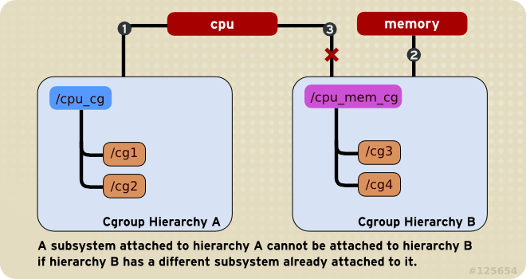
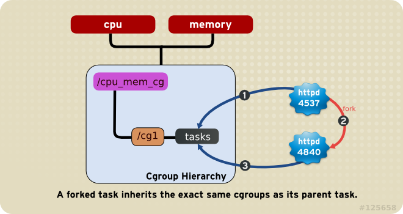

# Control Groups #
1. Red Hat Enterprise Linux 6 provided new kernel feature: control groups
2. Cgroups can be used to allocate resources (CPU time, system memory, network bandwidth, user-defined group of processes)
3. Features:
	1. We can monitor cgroups
	2. We can deny cgroups access to resources
	3. We can reconfigure cgroups dynamically on running system
4. `cgconfig`:
	1. It is a service that can be configured to startup at boot time and restablish cgroups (makes cgroups persistent across reboots)

## Organization of Control Groups ##
1. In a hierarchy
	1. Child cgroups inherit attributes of parents
2. Differences between processes and cgroups
	1. Linux Process:
		1. One common parent, many child processes
			1. `init`: started by kernel at boottime and starts other processes
			2. Single tree structure
		2. every process except `init` inherits environment (`PATH`) and file descriptors
	2. Cgroup Model:
		1. Similar to processes in the following:
			1. hierarchical
			2. child cgroups inherit properties from parent cgroup
		2. Many cgroup hierarchies can exist at a time
			1. Many trees of seaperate, unconnected tasks
		3. Reason: Each hierarchy is attached to one or more sub systems
			1. subsystem: single resource (CPU time, memory)

### Sub Systems ###
1. **blkio** - sets limits on i/o access to and from block devices (physical drives (disk, solid state, USB))
2. **cpu** - uses scheduler to provide cgroup tasks access to CPU.
3. **cpuacct** - generates reports on CPU resources used by tasks in cgroup
4. **cpuset** - assigns CPUs (for multi-core architecture) and memory nodes to tasks
5. **devices** - allows or denies access to devices by tasks in cgroups
6. **freezer** - suspends or resumes tasks in cgroup
7. **memory** - sets limits on memory use by tasks in cgroups and generates reports on memory resources used by tasks.
8. **net_cls** - tags network packets with class id that controls Linux traffic controller (tc) to identify packets originating from particular cgroup task
9. **net_prio** - provides way to dynamically set priority of network traffic per network interface
10. **ns** - namespace subsystem

## Relationships Between Subsystems, Hierarchies, Control Groups and Tasks ##
1. tasks: system processes
2. Rules
	1. Rule 1: single hierarchy can have one or more subsystems attached to it
		1. cpu and memory can be attached to a single hierarchy (they must not be attached to other hierarchies which have subsystems attached to them)

	
	2. Rule 2: A single subsystem cannot be attached to more than one hierarchy if one of those has different subsystem attached to it
		1. cpu cannot be attached to a hierarchy if memory is already attached to it
		2. Single subsystem can be attached to other hierarchy if only that subsystem is attached

	
	3. Rule 3: If new hierarchy is created, all tasks on system are initially members of default cgroup of that hierarchy (root cgroup)
		1. Each task can be a member of only one cgroup in the hierarchy
		2. Single tasks can be in multiple cgroups if the cgroups are in a different hierarchy
			1. If cpu and memory subystems are attached to a hierarchy named cpu_mem_cg, and net_cls subsystem is attached to a hierarchy named net, then httpd process can be a member of any cgrpu in cpu_mem_cg and any cgroup in net
			2. cgroup (cpu_meme_cg) might restrict CPU time to half of that allotted to other processes, limit memory usage to max 1024 MB. cgroup in net might limit transmission rate to 30 MB/s

	

	4. Rule 4: A process which forks itself creates a child task. Child task automatically inherits cgroup membership of its parent but can be moved to different cgroups.
		1. parent and child processes are independent
		2. Consider httpd task that is a member of cgroup half_cpu_1gb_max in cpu_and_mem hierarchy and a member of cgroup trans_rate_30 in net hierarchy.
			1. If httpd forks itself, child process automatically becomes member of half_cpu_1gb_max cgroup and trans_rate_30 cgroup.

	